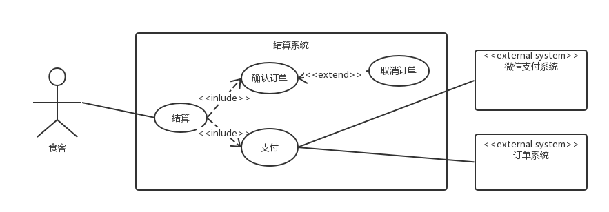
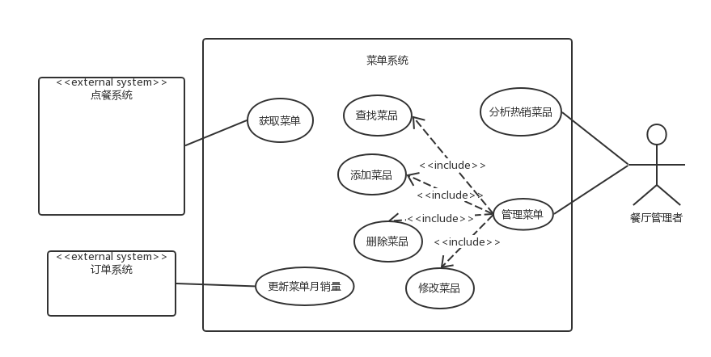

# Software Requirement Specification

>  软件规格说明书

[TOC]

## 1. 引言

### 1.1 编写目的 

​	编写此文档的目的是进一步定制软件开发的细节问题，便于用户与开发商协调工作，本文档面向的读者主要是项目委托单位的管理人员，希望能使本软件开发工作更具体 

### 1.2 项目背景 

​	手机支付逐渐成为当下餐饮业的主流，节省了现金支付的繁琐过程。

​	手机支付节省了一定的时间，但传统的点餐过程仍旧是繁琐的，食客进入小型的餐厅中点餐，服务员引导，客户下单，服务员传递订单到后厨；这一系列过程都是需要一个服务员为顾客进行一对一的服务的，在一些小型餐厅中人手不足，在面对许多顾客的点餐时会出现人手不足等问题，甚至被因此被客户评价服务差。对于客户这样的点餐体验无疑是繁琐而又不足的（特别是服务员不足的情况），对于商家这样的过程需要多余的人力成本，并且耗费的中间时间过多。

​	为了解决上述问题，我们为商家提供一个点餐平台，提供一套从用户点餐到后厨接单的在线服务系统。

## 2. 需求概述

### 2.1 目标系统

1. 餐厅信息管理系统
2. 菜单系统
3. 点餐系统
4. 结算系统
5. 订单系统

### 2.2 服务对象

1. 餐厅食客
2. 餐厅管理者

### 2.3 运行环境

1. 商家端：PC端浏览器
2. 客户端：移动端微信

### 2.4 条件与限制

1. 有线环境

## 3. 系统功能需求

### 3.1 商家端

#### 3.1.1 商家端功能

1. **注册登录餐厅（核心）**
    - **餐厅内容**：
      - 餐厅所有人，餐厅名，描述，图片
2. **管理菜单（核心）**
    - **功能**：菜单添加，修改，删除，查询
    - **菜单内容**：
      - 菜品类型标签
      - 单个菜品：菜名，图片，介绍，价格，耗时，菜品类型标签，点赞数，月均销量
3. **管理订单（核心）**
      - **功能**：订单接收，订单完成，订单查看，订单统计
      - **订单内容**：菜品名及数量，下单时间，结束时间，预估订单用时，订单状况（未完成/完成）
4. **计算预估清单用时（扩展）**
      - **功能**：清单倒计时，预估清单用时刷新
5. **查看评价（扩展）**
    - **功能**：查看评价内容，评价分类

### 3.2 客户端

#### 3.2.1 客户端功能

1. **查看菜单**
    - **菜单内容**：
      - 菜品类型标签
      - 单个菜品：菜名，图片，介绍，价格，耗时，菜品类型标签，点赞数，月均销量
2. **添加菜单到购物车**
    - **功能**：购物车菜品查看，菜品添加，菜品删除
    - **拟订单内容**：菜品及数量，总金额
3. **确认订单，并结算**
    - **功能**：购物车生成订单确认及结算，拟订单取消
    - **订单内容**：菜品名及数量，预估订单用时

## 4. 用例建模

### 4.1 系统逻辑关系图

 

### 4.2 点餐系统用例描述

>  **点餐用例图**

> casual用例

#### 4.2.1 查看餐厅信息

- **主要参与者**：顾客
- **目标**：顾客可以通过移动客户端浏览餐厅信息
- **概览**：顾客到达餐厅并选择餐桌就座，然后通过移动客户端，进入餐厅主页，浏览餐厅的基本信息。
- **类型**：用户目标级别
- **主成功场景**：
  1. 顾客到达餐厅，并选择餐桌就座。
  2. 顾客通过餐桌上的商家标识，运用自己的移动设备，获取餐厅的基本信息主页。

- **交替场景**：

   1. 如果餐厅的餐桌上没有提供商家的二维码或其他标识，顾客需要换张桌子或询问餐厅的服务员。

   2. 如果顾客获取餐厅信息失败，则告知用户刷新页面，重新进入。

   3. 如果顾客多次获取餐厅信息均失败，则告知用户可能是因为网络阻塞等原因而无法访问，并提示用户可以询问餐厅服务员。

#### 4.2.2 浏览菜品

- **主要参与者**：顾客

- **目标**：顾客可以通过移动客户端浏览餐厅的菜单

- **概览**：顾客通过餐厅主页上的“菜单”链接，进入到菜单列表并浏览菜单信息。

- **类型**：用户目标级别

- **主成功场景**：  

    1. 顾客点击餐厅主页上的“菜单”链接，进入餐厅的菜单列表，列表上包含菜品的图片以及售价等基本信息。
    2. 顾客上下滑动菜单列表，浏览菜单信息。
    3. 顾客点击列表上的菜品，显示菜品的详细信息（如材料，配菜，口味等）

- **交替场景**：

   1. 如果顾客获取餐厅菜单失败，则告知用户刷新页面，重新进入。

   2. 如果顾客多次获取餐厅菜单均失败，则告知用户可能是因为网络阻塞等原因而无法访问，并提示用户可以询问餐厅服务员。

   3. 如果菜品的图片缺失或加载失败，则在菜单中显示默认图片。

#### 4.2.3 添加菜品

- **主要参与者**：顾客

- **目标**：顾客可以在菜单列表中向其订单中添加菜品

- **概览**：顾客通过点击菜单列表中的“添加”按钮，将该菜品添加到自己的订单里。

- **类型**：用户目标级别

- **主成功场景**：

    1. 顾客点击菜单列表中的“添加”按钮，对应的菜品就会自动添加到顾客的订单中，同时更新订单金额。

- **交替场景**：

    1. 如果顾客多次添加同一菜品，则不重复往顾客订单里添加，而是更改顾客订单中该菜品的数量

    2. 如果顾客所要添加的菜品已售罄，则用户添加该菜品的操作无效，并提示用户该菜品已售罄，请选择其他在售的菜品

#### 4.2.4 移除菜品

- **主要参与者**：顾客

- **目标**：顾客可以从其订单中移除菜品

- **概览**：顾客通过点击菜单列表中的“移除”按钮，将该菜品从自己的订单里移除。

- **类型**：用户目标级别

- **主成功场景**：

    1. 顾客点击菜单列表中或订单内容中的“移除”按钮，对应的菜品就会自动从顾客的订单中移除掉，同时更新订单金额。

- **交替场景**：

   1. 如果顾客订单中的同一菜品的数量大于1，则不直接从顾客订单里移除该菜品，而是更改顾客订单中该菜品的数量

#### 4.2.5 结算

- **主要参与者**：顾客

- **目标**：顾客完成点餐过程并确认所点的菜品

- **概览**：顾客点餐完成并确认后，通过点击菜单列表中的“结算”按钮，以进行之后的订单提交和支付。

- **类型**：用户目标级别

- **主成功场景**：

    1. 顾客完成菜品选择，选择“结算”提交订单
    2. 系统询问顾客是否确认所选菜品信息无需更改
    3. 顾客确认订单，则订单传送到结算系统
    4. 顾客点餐完成，等待结算系统处理订单

- **交替场景**：

    1. 如果顾客需要更改选择的菜品信息，则取消顾客此次的结算操作，用户可以继续添加或者移除菜品。
    2. 如果系统检测到与外部结算系统通信失败，则告知用户发生错误位置，提示用户重新进行操作。

 

### 4.3 结算系统用例描述

- 用例图

> full用例

#### 4.3.1 确认订单

- **范围**：知单订单结算应用
- **级别**：用户目标
- **主要参与者**：食客
- **涉及及其关注点**：
  1. 食客：希望能基本无延迟的确认订单。
  2. 餐厅管理者：希望能够基本无延迟的得到订单确认的通知。
- **前置条件**：食客必须注册登录应用并且选好餐。
- **成功保证**：准确及时地完成订单确认的消息传递。
- **主成功场景**：
  1. 食客选好餐后进入结算系统，能发现有确认订单的选择。
  2. 食客按下确认订单后，能正常进入支付界面。
  3. 30秒内支付成功后，订单系统能收到确认的订单信息。
  4. 至此，确认订单的一次使用完毕。
- **扩展**：餐厅管理者在发现订单数据有异常时应可以对此提出疑问，便立刻向后端进行同步数据。
- **特殊需求**：应支持多国语言
- **技术和数据变元素**：确认订单后，支付成功后才提交订单。
- **发生频率**：经常发生
- **杂项**：UI要做的简洁易懂

#### 4.3.1 支付

- **范围**：知单订单结算应用
- **级别**：用户目标
- **主要参与者**：食客
- **涉及及其关注点**：
  1. 食客：希望能安全边界地进行支付。
  2. 餐厅管理者：希望能够及时快速准确的接受到支付成功信息。
- **前置条件**：食客必须注册登录应用并且授权支付功能。
- **成功保证**：
  1. 食客余额充足，网络良好。
  2. 及时收到支付信息。
- **主成功场景**：
  1. 食客进入支付界面后，能选择各种支付方式，并且能成功调用相应的支付系统。
  2. 确认支付需要食客的身份认证。
  3. 订单系统能收到支付后的订单。
  4. 至此，支付的一次使用完毕。
- **扩展**：餐厅管理者在发现扣费异常时应可以对此提出疑问，便立刻向后端进行同步数据。
- **特殊需求**：应支持多国语言
- **技术和数据变元素**：进行支付操作时，需要认证（指纹或者密码）
- **发生频率**：经常发生
- **杂项**：UI要做的简洁易操作

 

### 4.4 订单系统用例描述

>  订单用例图

> full用例

 

### 4.5 菜单系统用例描述

> 菜单用例图

#### 4.5.1 查找菜品

- **参与者** ： 餐厅管理者

- **描述** ： 管理者进入查找菜品页面，输入菜品信息（如名称，价格等）后点击查询，程序查询数据库后返回查询结果，以一定UI显示方式反馈给管理者。

#### 4.5.2 添加菜品

- **参与者** ： 餐厅管理者

- **描述** ： 管理者进入添加菜品页面，输入菜品信息（如名称，价格，预览图等）后点击添加，程序为后端数据库添加此菜品数据，并反馈在菜品总览UI上。

#### 4.5.3 删除菜品

- **参与者** ： 餐厅管理者

- **描述** ： 管理者进入删除菜品页面，选择一个或多个菜品后点击删除，程序为后端数据库删除此菜品数据，并反馈在菜品总览UI上。

#### 4.5.4 修改菜品

- **参与者** ： 餐厅管理者

- **描述** ： 管理者进入修改菜品页面，输入修改后的菜品属性，程序为后端数据库修改此菜品数据，并反馈在菜品总览UI上。

 

### 4.6 餐厅信息管理系统用例描述

> 餐厅信息管理用例图

> brief用例

#### 4.6.1 注册

- 参与者：餐厅管理者

- 描述：管理者输入注册信息，数据库中已经含有的信息不能再次注册，注册成功将信息录入数据库

#### 4.6.2 登陆

- 参与者：餐厅管理者

- 描述：管理者输入登录信息，检查用户名密码是否匹配，登录成功跳转餐厅信息页面

#### 4.6.3 编辑基本信息

- 参与者：餐厅管理者

- 描述：餐厅管理者登陆状态下可修改餐厅基本信息

#### 4.6.4 获取餐厅信息

- 参与者：点餐系统

- 描述：点餐系统自动获取当前对应的餐厅信息

